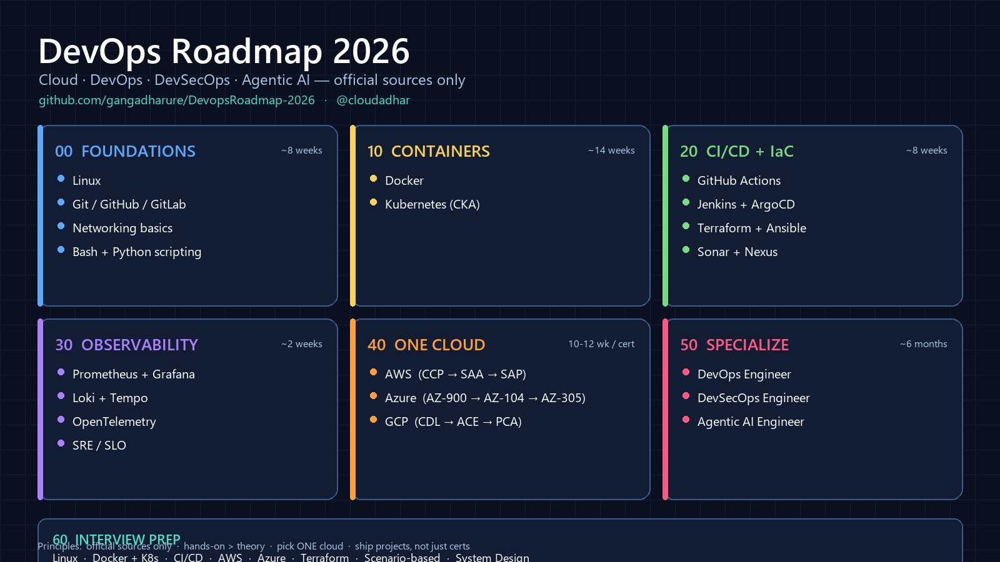

# Roadmap 2026 — Cloud, DevOps & AI Career Tracks

> Hand-curated, **official-source-only** roadmaps for the most in-demand cloud, DevOps and AI roles of 2026.
> No paid course promotion. No affiliate links. Just the path — and the official docs.

Maintained by [**@cloudadhar**](https://instagram.com/cloudadhar) · Updated May 2026



---

## 🗂️ Repo structure

```
00-Foundations/              Linux · Git · Networking · Scripting
10-Containers-Orchestration/ Docker · Kubernetes (CKA)
20-CI-CD-IaC/                GitHub Actions · Jenkins+ArgoCD · Terraform+Ansible · Sonar+Nexus
30-Observability/            Prometheus · Grafana · Loki · OpenTelemetry · SRE
40-Cloud-Certification-Paths/ AWS · Azure · GCP
50-Specializations/          DevOps · DevSecOps · Agentic AI
60-Interview-Prep/           (coming soon)
```

Folders are number-prefixed so they sort in **learning order**.

---

## 📚 All roadmaps

### 00 — Foundations
| Track | Time | Folder |
|-------|------|--------|
| Linux for Cloud & DevOps | 4-6 wk | [00-Foundations/01-Linux](./00-Foundations/01-Linux) |
| Git · GitHub · GitLab | 2 wk | [00-Foundations/02-Git-GitHub-GitLab](./00-Foundations/02-Git-GitHub-GitLab) |
| Networking Basics | 2 wk | [00-Foundations/03-Networking-Basics](./00-Foundations/03-Networking-Basics) |
| Scripting (Bash + Python) | 3-4 wk | [00-Foundations/04-Scripting](./00-Foundations/04-Scripting) |

### 10 — Containers & Orchestration
| Track | Time | Folder |
|-------|------|--------|
| Docker | 2 wk | [10-Containers-Orchestration/01-Docker](./10-Containers-Orchestration/01-Docker) |
| Kubernetes (CKA) | 10-12 wk | [10-Containers-Orchestration/02-Kubernetes-CKA](./10-Containers-Orchestration/02-Kubernetes-CKA) |

### 20 — CI/CD & IaC
| Track | Time | Folder |
|-------|------|--------|
| GitHub Actions | 1-2 wk | [20-CI-CD-IaC/01-GitHub-Actions](./20-CI-CD-IaC/01-GitHub-Actions) |
| Jenkins + ArgoCD | 2 wk | [20-CI-CD-IaC/02-Jenkins-ArgoCD](./20-CI-CD-IaC/02-Jenkins-ArgoCD) |
| Terraform + Ansible (IaC) | 4 wk | [20-CI-CD-IaC/03-IaC-Terraform-Ansible](./20-CI-CD-IaC/03-IaC-Terraform-Ansible) |
| SonarQube + Nexus | 1 wk | [20-CI-CD-IaC/04-Sonar-Nexus](./20-CI-CD-IaC/04-Sonar-Nexus) |

### 30 — Observability
| Track | Time | Folder |
|-------|------|--------|
| Prometheus + Grafana + Loki | 2 wk | [30-Observability/01-Prometheus-Grafana-Loki](./30-Observability/01-Prometheus-Grafana-Loki) |

### 40 — Cloud Certification Paths
| Track | Time | Folder |
|-------|------|--------|
| AWS Path (CCP → SAA → SAP / DevOps Pro) | 10-12 wk per cert | [40-Cloud-Certification-Paths/01-AWS-Path](./40-Cloud-Certification-Paths/01-AWS-Path) |
| Azure Path (AZ-900 → AZ-104 → AZ-305 / AZ-400) | 10-12 wk per cert | [40-Cloud-Certification-Paths/02-Azure-Path](./40-Cloud-Certification-Paths/02-Azure-Path) |
| GCP Path (CDL → ACE → PCA / PCDE) | 10-12 wk per cert | [40-Cloud-Certification-Paths/03-GCP-Path](./40-Cloud-Certification-Paths/03-GCP-Path) |

### 50 — Specializations (role-based)
| Track | Time | Folder |
|-------|------|--------|
| DevOps Engineer | 6 mo | [50-Specializations/01-DevOps-Engineer](./50-Specializations/01-DevOps-Engineer) |
| DevSecOps Engineer | 6 mo | [50-Specializations/02-DevSecOps-Engineer](./50-Specializations/02-DevSecOps-Engineer) |
| Agentic AI Engineer | 6 mo | [50-Specializations/03-Agentic-AI-Engineer](./50-Specializations/03-Agentic-AI-Engineer) |

### 60 — Interview Prep
| Topic | File |
|-------|------|
| Linux | [60-Interview-Prep/01-Linux.md](./60-Interview-Prep/01-Linux.md) |
| Docker & Kubernetes | [60-Interview-Prep/02-Docker-Kubernetes.md](./60-Interview-Prep/02-Docker-Kubernetes.md) |
| CI/CD | [60-Interview-Prep/03-CI-CD.md](./60-Interview-Prep/03-CI-CD.md) |
| AWS | [60-Interview-Prep/04-AWS.md](./60-Interview-Prep/04-AWS.md) |
| Azure | [60-Interview-Prep/05-Azure.md](./60-Interview-Prep/05-Azure.md) |
| Terraform / IaC | [60-Interview-Prep/06-Terraform.md](./60-Interview-Prep/06-Terraform.md) |
| Scenario-based | [60-Interview-Prep/07-Scenario-Based.md](./60-Interview-Prep/07-Scenario-Based.md) |
| System Design | [60-Interview-Prep/08-System-Design.md](./60-Interview-Prep/08-System-Design.md) |

---

## 🧭 Suggested learning order

```
  00 FOUNDATIONS  →  10 CONTAINERS  →  20 CI/CD + IaC  →  30 OBSERVABILITY
       │                                                          │
       └──────────────  40 ONE CLOUD (AWS or Azure or GCP)  ──────┘
                                       │
                                       ▼
                          50 SPECIALIZE (DevOps / DevSecOps / Agentic AI)
```

**Reality check:** Don't chase 3 clouds. Pick **one** (AWS *or* Azure *or* GCP) and go deep. Add Kubernetes. Then specialize.

---

## ✅ How to use this repo

1. Start with [00-Foundations/01-Linux](./00-Foundations/01-Linux) — every track assumes it.
2. Add Git, basic networking, and a scripting language while you're at it.
3. Learn Docker, then Kubernetes (CKA is the gold-standard cert).
4. Pick **one** cloud and complete its associate-level cert.
5. Add CI/CD, IaC, and observability — these are the day-job of every DevOps role.
6. Specialize into DevOps / DevSecOps / Agentic AI based on your interest.

Each `ROADMAP.md` has: week-by-week plan, official resources only, hands-on labs, interview topics.

---

## 🎯 Principles I follow

1. **Official sources only.** AWS docs, Microsoft Learn, cloud.google.com, kubernetes.io, Linux Foundation, OWASP, CNCF.
2. **Hands-on > theory.** If you can't build it, you don't know it.
3. **One cloud at first.** Master one, then sample others.
4. **Linux is the floor, not the ceiling.** Every cloud cert assumes you know it.
5. **Certifications are checkpoints, not destinations.** Real growth comes from projects + production experience.

---

## 🤝 Contributing

Found an outdated link or a better official resource? Open a PR — keep it official, keep it free. See [CONTRIBUTING.md](./CONTRIBUTING.md).

## 📜 License

[MIT](./LICENSE) — use these roadmaps freely. Credit appreciated, not required.

## 📬 Connect

- Instagram: [@cloudadhar](https://instagram.com/cloudadhar)
- LinkedIn: search "CloudAdhar"
- DM "ROADMAP" on Instagram for updates
